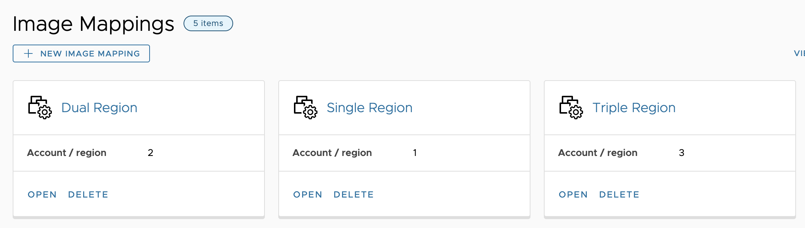
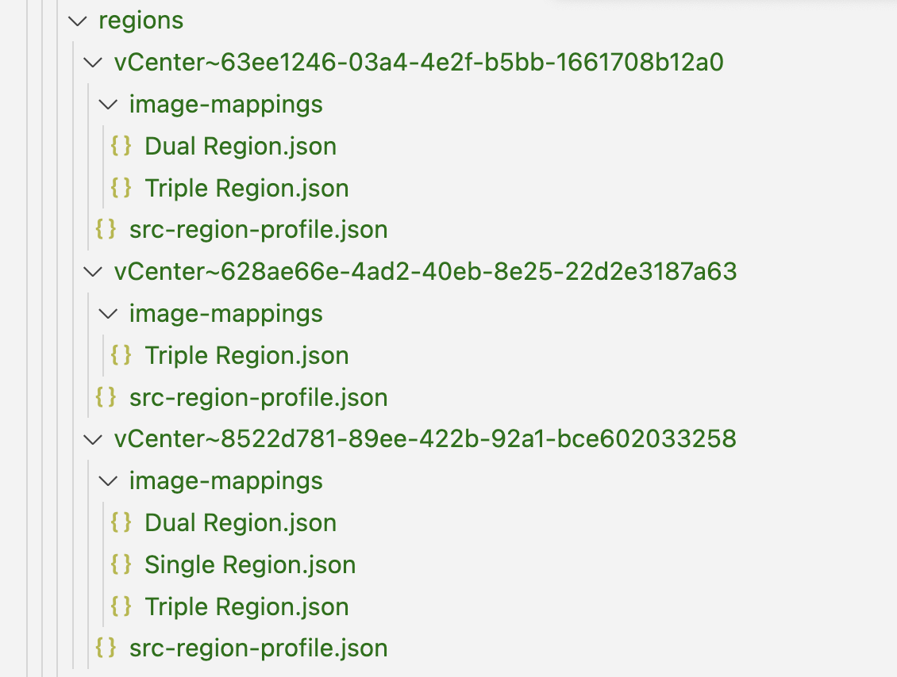
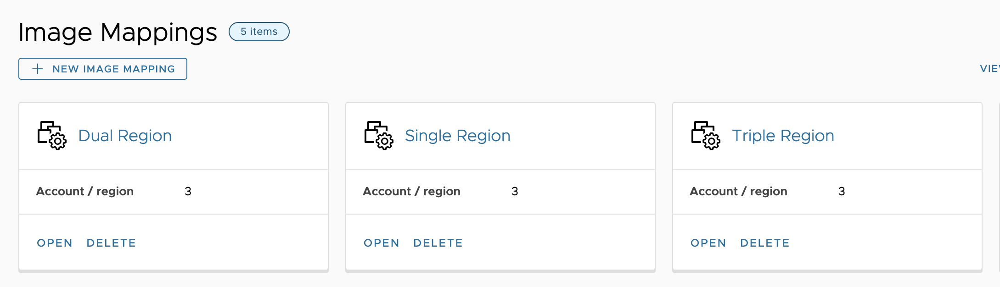
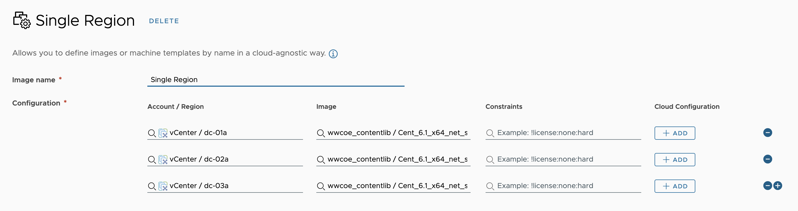
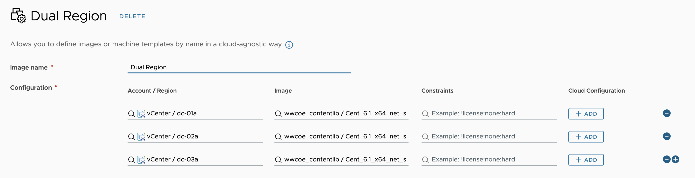
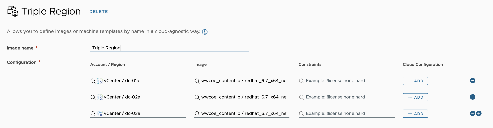

# (Incomplete) Bug Report [#207](https://github.com/vmware/build-tools-for-vmware-aria/issues/207) - Last region images mapping overwrites the value for all other regions.

## Table of Contents
- [Bug Report [#207]](#bug-report-207---last-region-images-mapping-overwrites-the-value-for-all-other-regions)
  - [Background](#background)
    - [Context](#context)
    - [Pulling](#pulling)
    - [Pushing](#pushing)
  - [Issue](#issue)
    - [Steps to reproduce](#steps-to-reproduce)
    - [Expected behavior](#expected-behavior)
    - [Actual behavior](#actual-behavior)
    - [Reproduces how often](#reproduces-how-often)
    - [Component](#component)
    - [Environment](#environment)
      - [Client](#client)
      - [Server](#server)
    - [Additional Context](#additional-context)
  - [Reproduction](#reproduction)
    - [Steps](#steps)
    - [Results](#results)
  - [Root Cause Analysis](#root-cause-analysis)
  - [Proposed Solution](#proposed-solution)
  - [Solution Results](#solution-results)
  - [Solution Denial](#solution-denial)
    - [Why](#why)
    - [But it's been working fine... ish](#but-its-been-working-fine-ish)
  - [Partial Conclusion](#partial-conclusion)
- [ToDo: Redesign Proposition](#redesign-proposition)
  - [ToDo: Proposed Solution](#proposed-solution)
  - [ToDo: Steps to Implement the Solution](#steps-to-implement-the-solution)
  - [ToDo: Expected Results]()
  - [ToDo: Risks and Mitigation Strategies]()
  - [ToDo: Impact Analysis]()
  - [ToDo: Conclusion]()
  - [ToDo: Next Steps]()
  - [ToDo: References]()

## Background
### Context
[Build tools for VMware Aria](https://github.com/vmware/build-tools-for-vmware-aria) has a functionality to pull and push image mappings and regions.

- `Regions` are the unique vCenter `data centers`, imported for the linked Aria `cloud accounts` following the `{cloudAccountName} / {dataCenterName}` naming convention.

- `Images` are the available VM templates.

- `Image Mappings` are named M:M relations between existing `images` and `regions`

Image mappings can be defined in [Aria Automation](https://vra-l-01a.corp.local/automation-ui/#/provisioning-ui;ash=%2Fimages%2Fname).


And every image mapping can map to a specific image in each of its respective regions.


To do a pull, we have to specify the `image-mapping` names in Orchestrator's `content.yaml` as well as the `region-mapping` tags.
```yaml
blueprint:
subscription:
flavor-mapping: []
image-mapping: 
  - Single Region
  - Dual Region
  - Triple Region
storage-profile: []
region-mapping:
  cloud-account-tags:
    export-tag: "env:dev"
    import-tags: ["env:dev"]
catalog-item:
custom-resource:
resource-action:
catalog-entitlement:
content-source:
policy:
```

### Pulling
Pulling generates a correct representation of the image mappings, grouped by the respective regions.


Each regions's `src-region-profile.json` uniquely maps the region by the target's `cloudAccountId` and `regionId` itself.
```json
{
  "cloudAccountId": "ab6eca9a-7ca7-4a24-b51b-85e1a4dafac8",
  "regionId": "8522d781-89ee-422b-92a1-bce602033258",
  "regionType": "vsphere",
  "tags": [
    "env:dev"
  ]
}
```

Wherever an image mapping has multiple regions, duplicate records for the image mapping are created in the respective region's directory, containing the specific region's image `externalId`.
```json
{
  "isPrivate": false,
  "externalId": "wwcoe_contentlib / centOS_non_existing",
  "name": "wwcoe_contentlib / centOS_non_existing"
}
```

### Pushing
Originally, and in line with the project's other resource elements, pushing is expected to populate Aria with the resources as described in code.

## Issue
When importing the image mappings, it seems like the last one to be processed, would overwrite the data for the previous regions. Meaning that if you have image mappings that point to: `Test-1`, `Test-2`, `Test-3` images, then after import the one that was processed last will be the one that is in use everywhere.

In the tested environment we had 3 data centers and one of the data center had 2 regions, if that matters

### Steps to reproduce
* Create an image mapping with 2 regions with different values for the same image.
* Pull them and observe the data.
* Push the image mappings and both will have the same value instead of different ones.

### Expected behavior
The region mappings to be mapped correctly per region.

### Actual behavior
Last one overwrites all the rest.

### Reproduces how often
- 100%

### Component:
- artifact-manager

### Environment
#### Client
- Build Tools for VMware Aria Version: 2.36.0
#### Server
- vRealize Automation Version: 8.13
- vRealize Orchestrator Version: 8.13

### Additional Context
This is when pulling and pushing to the SAME environment.

## Reproduction
### Steps
* Setting up an environment with 3 regions and 3 image mappings, as can be seen in the [Background](#background) section.
  * `Single Region`, a mapping with a single region.
  * `Dual Region`, a mapping with two regions.
  * `Triple Region`, a mapping with three regions.
* Pulling from the environment, as can be seen in the [Pulling](#pulling) section.
* Pushing without any changes.
* Expecting the environment image mappings to remain the same.

### Results
Executing the reproduction steps produces an incorrect environment state, just as described in the [Issue](#issue) section. 

```
- main\resources\regions\
  - vCenter~8522d781-89ee-422b-92a1-bce602033258\
    - image-mappings\
      - Triple Region.json
```
```json
{
  "constraints": [],
  "isPrivate": false,
  "externalId": "wwcoe_contentlib / centOS_non_existing",
  "name": "Triple Region"
}
```

Execution changes all of the environment image mappings to have 3 regions and all of the regions to have the same image, regardless of what was previously there.






There isn't any apparent indication as to which of the code `externalId` of the original images gets populated after the push. It does not appear to be the file system's latest one, as indicated in the issue.

## Root Cause Analysis
As originally performed by [Eman Elsayed](https://github.com/emanelsayed39) and later confirmed by [Ivan Zdravkov](https://github.com/ivan-zdravkov) and [Sugeesh Chandraweera](https://github.com/sugeeshC), the cause of the bug is a missing check in the [importContent](https://github.com/vmware/build-tools-for-vmware-aria/blob/19f84953483c0c7bd08af56d20cd07fcacf5b6dc/common/artifact-manager/src/main/java/com/vmware/pscoe/iac/artifact/store/vrang/VraNgImageMappingStore.java#L186) method of the [VraNgImageMappingStore.java](https://github.com/vmware/build-tools-for-vmware-aria/blob/19f84953483c0c7bd08af56d20cd07fcacf5b6dc/common/artifact-manager/src/main/java/com/vmware/pscoe/iac/artifact/store/vrang/VraNgImageMappingStore.java) file.

As a result the regions are not filtered properly, and every image mapping gets inserted every region resulting in the latest execution to override every change previously.

## Proposed Solution
A simple nearly identical solution was proposed by each of the investigating members which adds a check to ensure each region correctly processes only their own records.

```diff
// list all directories in the regions folder
Arrays.asList(regionsFolder.listFiles(File::isDirectory)).forEach(regionProfileDir -> {
    try {
        VraNgCloudRegionProfile cloudRegionProfile = VraNgRegionalContentUtils.getCloudRegionProfile(regionProfileDir);
        cloudAccounts
            .stream()
            .filter(cloudAccount -> VraNgRegionalContentUtils.isIntersecting(cloudAccount.getTags(), importTags))
            .filter(cloudAccount -> cloudAccount.getType().equals(cloudRegionProfile.getRegionType()))
            .forEach(cloudAccount -> cloudAccount.getRegionIds()
-               .forEach(regionId -> this.importImageProfilesInRegion
+               .forEach(regionId -> {
+                   boolean shouldImport = regionProfileDir.getName().contains(regionId);
+                        
+                   if (shouldImport) {
+                       this.importImageProfilesInRegion(
                            regionId,
                            regionProfileDir,
-                           imageProfilesByRegion)));
+                           imageProfilesByRegion);
+                   }
+               }
+           ));
    } catch (IOException e) {
        e.printStackTrace();
    }
});
```

## Solution Results
As a result of the implemented solution, pushing the regions now correctly populates them in Aria, resulting in the original state of the environment.

## Solution Denial
### Why
In a high level discussion with [Stefan Genov](https://github.com/Michaelpalacce), the proposed solution was denied.

It turns out that the alleged original intention of the module is very environmentally dependent. All of the entities in question (Cloud Account, Region, Image, etc.) are kept in code by their ids and not by their name, tag or another environmentally agnostic handler. 

This means that pulling from a dev environment and trying to push into a client environment will never work, since no matching of ids will ever occur.

### But it's been working fine... ish
What `accidentally` had been happening all along is that:
1. We usually `develop` with a `single` dev region.
2. The `client` usually has `multiple` regions.
3. We are pulling image mappings for a single region from our environment.
4. Due to the bug, the mapping populates for `all` of the regions on the client environment.
5. This is usually a kind-of OK scenario regarding what the client gets in the end, although based on a bug on top of a the original design.

## Partial Conclusion
Fixing the issue as proposed will `restore` the original design, but will actually `worsen` the dev and client experience.

We discussed a number of ways of how to address this, so that it would both work as intended and continue doing meaningful work, and decided against implementing a
* `patch` on top of a `bug` on top of the `original` design,

while simultaneously trying to both fix it and keep the accidental behavior of 
* pushing our image mappings on all client regions

Since the issue of how to map `dev` and `client` entity ids is both hard and requiring a lot of manual work post-implementation, we are currently looking into a solution redesign, which will try to solve the problems of
* Reliably and environmentally independently define image mappings in code.
* Ensuring backwards compatibility.

# Redesign Proposition

## Proposed Solution
[Provide a detailed explanation of the proposed solution to address the problem.]

## Steps to Implement the Solution
1. [Step 1]
2. [Step 2]
3. [Step 3]
    - [Sub-step 1]
    - [Sub-step 2]
4. [Step 4]

## Expected Results
[Describe the expected results after implementing the proposed solution.]

## Risks and Mitigation Strategies
[Identify any potential risks associated with the proposed solution and provide mitigation strategies.]

## Impact Analysis
[Analyze the potential impact of the solution on other parts of the system or project.]

## Conclusion
[Summarize the solution redesign and its expected benefits.]

## Next Steps
[Outline the next steps to be taken, such as implementation, testing, and deployment.]

## References
[Provide any references or resources that were used to develop the solution redesign.]
