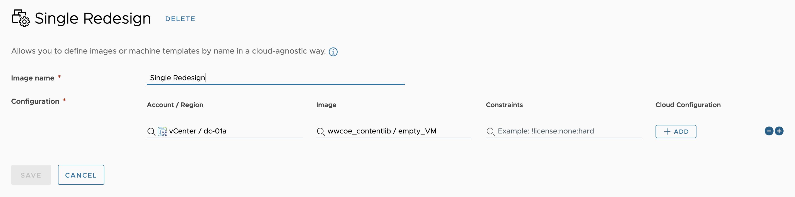
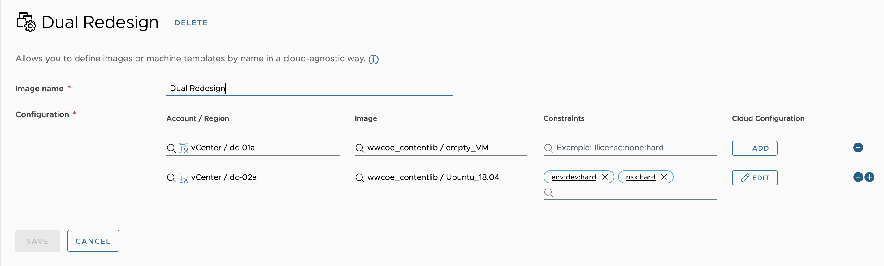
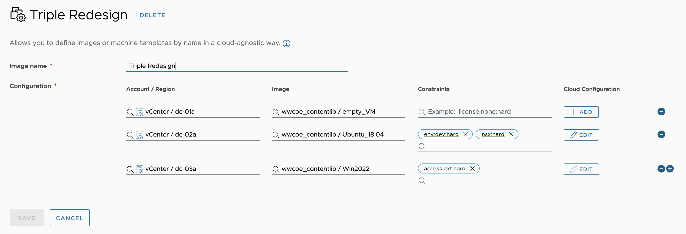
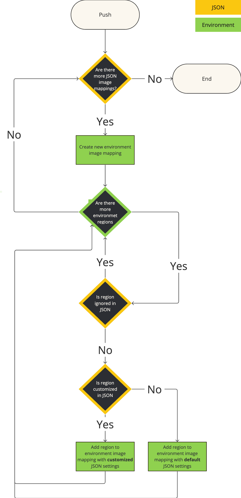
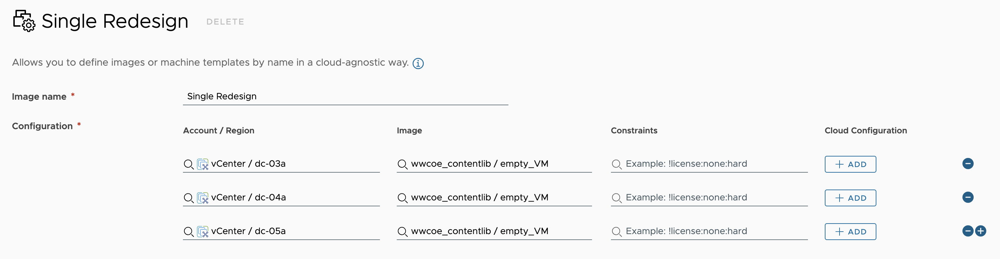
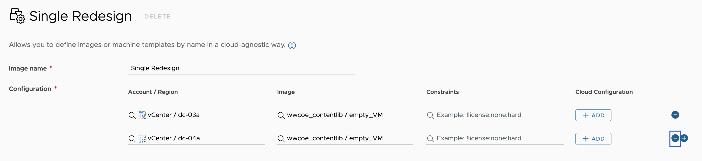
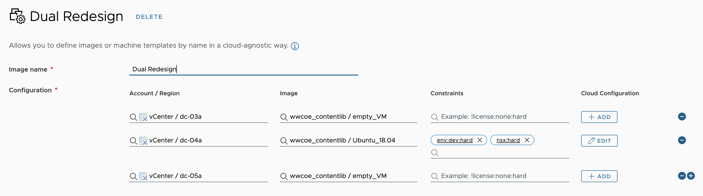

# Bug Report [#207](https://github.com/vmware/build-tools-for-vmware-aria/issues/207) - Last region images mapping overwrites the value for all other regions.

## Table of Contents
- [Bug Report [#207]](#bug-report-207---last-region-images-mapping-overwrites-the-value-for-all-other-regions)
  - [Background](#background)
    - [Context](#context)
    - [Pulling](#pulling)
    - [Pushing](#pushing)
  - [Issue](#issue)
    - [Steps to reproduce](#steps-to-reproduce)
    - [Expected behavior](#expected-behavior)
    - [Actual behavior](#actual-behavior)
    - [Reproduces how often](#reproduces-how-often)
    - [Component](#component)
    - [Environment](#environment)
      - [Client](#client)
      - [Server](#server)
    - [Additional Context](#additional-context)
  - [Reproduction](#reproduction)
    - [Steps](#steps)
    - [Results](#results)
  - [Root Cause Analysis](#root-cause-analysis)
  - [Proposed Solution](#proposed-solution)
  - [Solution Results](#solution-results)
  - [Solution Denial](#solution-denial)
    - [Why](#why)
    - [But it's been working fine... ish](#but-its-been-working-fine-ish)
  - [Partial Conclusion](#partial-conclusion)
- [Redesign Proposition](#redesign-proposition)
  - [JSON structure](#json-structure)
  - [Setup](#setup)
    - [Dev Environment Regions](#dev-environment-regions)
    - [Client Environment Regions](#client-environment-regions)
    - [Dev Environment Image Mappings](#dev-environment-image-mappings)
  - [Pulling](#pulling-1)
    - [single-redesign.json](#single-redesignjson)
    - [dual-redesign.json](#dual-redesignjson)
    - [triple-redesign.json](#triple-redesignjson)
  - [Pushing](#pushing-1)
    - [Algorithm](#algorithm)
    - [Same Environment](#same-environment)
    - [Different Environment](#different-environment)
    - [Examples](#examples)
      - [Default Scenario](#default-scenario)
      - [Ignoring a Region](#ignoring-a-region)
      - [Customizing a Region](#customizing-a-region)
  - [Backwards Compatibility](#backwards-compatibility)
    - [Functionality](#functionality)
    - [Structure](#structure)
    - [Release Planning](#release-planning)
  - [Risks and Mitigation Strategies](#risks-and-mitigation-strategies)
  - [Impact Analysis](#impact-analysis)
    - [Functional](#functional)
    - [Non-Functional](#non-functional)
- [Next Steps](#next-steps)

## Background
### Context
[Build tools for VMware Aria](https://github.com/vmware/build-tools-for-vmware-aria) has a functionality to pull and push image mappings and regions.

- `Regions` are the unique vCenter `data centers`, imported for the linked Aria `cloud accounts` following the `{cloudAccountName} / {dataCenterName}` naming convention.

- `Images` are the available VM templates.

- `Image Mappings` are named M:M relations between existing `images` and `regions`

Image mappings can be defined in [Aria Automation](https://vra-l-01a.corp.local/automation-ui/#/provisioning-ui;ash=%2Fimages%2Fname).


And every image mapping can map to a specific image in each of its respective regions.


To do a pull, we have to specify the `image-mapping` names in Orchestrator's `content.yaml` as well as the `region-mapping` tags.
```yaml
blueprint:
subscription:
flavor-mapping: []
image-mapping: 
  - Single Region
  - Dual Region
  - Triple Region
storage-profile: []
region-mapping:
  cloud-account-tags:
    export-tag: "env:dev"
    import-tags: ["env:dev"]
catalog-item:
custom-resource:
resource-action:
catalog-entitlement:
content-source:
policy:
```

### Pulling
Pulling generates a correct representation of the image mappings, grouped by the respective regions.


Each regions's `src-region-profile.json` uniquely maps the region by the target's `cloudAccountId` and `regionId` itself.
```json
{
  "cloudAccountId": "ab6eca9a-7ca7-4a24-b51b-85e1a4dafac8",
  "regionId": "8522d781-89ee-422b-92a1-bce602033258",
  "regionType": "vsphere",
  "tags": [
    "env:dev"
  ]
}
```

Wherever an image mapping has multiple regions, duplicate records for the image mapping are created in the respective region's directory, containing the specific region's image `externalId`.
```json
{
  "isPrivate": false,
  "externalId": "wwcoe_contentlib / centOS_non_existing",
  "name": "wwcoe_contentlib / centOS_non_existing"
}
```

### Pushing
Originally, and in line with the project's other resource elements, pushing is expected to populate Aria with the resources as described in code.

## Issue
When importing the image mappings, it seems like the last one to be processed, would overwrite the data for the previous regions. Meaning that if you have image mappings that point to: `Test-1`, `Test-2`, `Test-3` images, then after import the one that was processed last will be the one that is in use everywhere.

In the tested environment we had 3 data centers and one of the data center had 2 regions, if that matters

### Steps to reproduce
* Create an image mapping with 2 regions with different values for the same image.
* Pull them and observe the data.
* Push the image mappings and both will have the same value instead of different ones.

### Expected behavior
The region mappings to be mapped correctly per region.

### Actual behavior
Last one overwrites all the rest.

### Reproduces how often
- 100%

### Component:
- artifact-manager

### Environment
#### Client
- Build Tools for VMware Aria Version: 2.36.0
#### Server
- vRealize Automation Version: 8.13
- vRealize Orchestrator Version: 8.13

### Additional Context
This is when pulling and pushing to the SAME environment.

## Reproduction
### Steps
* Setting up an environment with 3 regions and 3 image mappings, as can be seen in the [Background](#background) section.
  * `Single Region`, a mapping with a single region.
  * `Dual Region`, a mapping with two regions.
  * `Triple Region`, a mapping with three regions.
* Pulling from the environment, as can be seen in the [Pulling](#pulling) section.
* Pushing without any changes.
* Expecting the environment image mappings to remain the same.

### Results
Executing the reproduction steps produces an incorrect environment state, just as described in the [Issue](#issue) section. 

```
- main\resources\regions\
  - vCenter~8522d781-89ee-422b-92a1-bce602033258\
    - image-mappings\
      - Triple Region.json
```
```json
{
  "constraints": [],
  "isPrivate": false,
  "externalId": "wwcoe_contentlib / centOS_non_existing",
  "name": "Triple Region"
}
```

Execution changes all of the environment image mappings to have 3 regions and all of the regions to have the same image, regardless of what was previously there.


There isn't any apparent indication as to which of the code `externalId` of the original images gets populated after the push. It does not appear to be the file system's latest one, as indicated in the issue.

## Root Cause Analysis
As originally performed by [Eman Elsayed](https://github.com/emanelsayed39) and later confirmed by [Ivan Zdravkov](https://github.com/ivan-zdravkov) and [Sugeesh Chandraweera](https://github.com/sugeeshC), the cause of the bug is a missing check in the [importContent](https://github.com/vmware/build-tools-for-vmware-aria/blob/19f84953483c0c7bd08af56d20cd07fcacf5b6dc/common/artifact-manager/src/main/java/com/vmware/pscoe/iac/artifact/store/vrang/VraNgImageMappingStore.java#L186) method of the [VraNgImageMappingStore.java](https://github.com/vmware/build-tools-for-vmware-aria/blob/19f84953483c0c7bd08af56d20cd07fcacf5b6dc/common/artifact-manager/src/main/java/com/vmware/pscoe/iac/artifact/store/vrang/VraNgImageMappingStore.java) file.

As a result the regions are not filtered properly, and every image mapping gets inserted every region resulting in the latest execution to override every change previously.

## Proposed Solution
A simple nearly identical solution was proposed by each of the investigating members which adds a check to ensure each region correctly processes only their own records.

```diff
// list all directories in the regions folder
Arrays.asList(regionsFolder.listFiles(File::isDirectory)).forEach(regionProfileDir -> {
    try {
        VraNgCloudRegionProfile cloudRegionProfile = VraNgRegionalContentUtils.getCloudRegionProfile(regionProfileDir);
        cloudAccounts
            .stream()
            .filter(cloudAccount -> VraNgRegionalContentUtils.isIntersecting(cloudAccount.getTags(), importTags))
            .filter(cloudAccount -> cloudAccount.getType().equals(cloudRegionProfile.getRegionType()))
            .forEach(cloudAccount -> cloudAccount.getRegionIds()
-               .forEach(regionId -> this.importImageProfilesInRegion
+               .forEach(regionId -> {
+                   boolean shouldImport = regionProfileDir.getName().contains(regionId);
+                        
+                   if (shouldImport) {
+                       this.importImageProfilesInRegion(
                            regionId,
                            regionProfileDir,
-                           imageProfilesByRegion)));
+                           imageProfilesByRegion);
+                   }
+               }
+           ));
    } catch (IOException e) {
        e.printStackTrace();
    }
});
```

## Solution Results
As a result of the implemented solution, pushing the regions now correctly populates them in Aria, resulting in the original state of the environment.

## Solution Denial
### Why
In a high level discussion with [Stefan Genov](https://github.com/Michaelpalacce), the proposed solution was denied.

It turns out that the alleged original intention of the module is very environmentally dependent. All of the entities in question (Cloud Account, Region, Image, etc.) are kept in code by their ids and not by their name, tag or another environmentally agnostic handler. 

This means that pulling from a dev environment and trying to push into a client environment will never work, since no matching of ids will ever occur.

### But it's been working fine... ish
What `accidentally` had been happening all along is that:
1. We usually `develop` with a `single` dev region.
2. The `client` usually has `multiple` regions.
3. We are pulling image mappings for a single region from our environment.
4. Due to the bug, the mapping populates for `all` of the regions on the client environment.
5. This is usually a kind-of OK scenario regarding what the client gets in the end, although based on a bug on top of a the original design.

## Partial Conclusion
Fixing the issue as proposed will `restore` the original design, but will actually `worsen` the dev and client experience.

We discussed a number of ways of how to address this, so that it would both work as intended and continue doing meaningful work, and decided against implementing a
* `patch` on top of a `bug` on top of the `original` design,

while simultaneously trying to both fix it and keep the accidental behavior of 
* pushing our image mappings on all client regions

Since the issue of how to map `dev` and `client` entity ids is both hard and requiring a lot of manual work post-implementation, we are currently looking into a solution redesign, which will try to solve the problems of
* Reliably and environmentally independently define image mappings in code.
* Ensuring backwards compatibility.

# Redesign Proposition
The current solution relies on entity ids to define image mappings and regions, which makes it difficult to achieve environmental independence.

Having a full dev-client environment mapping as discussed earlier is both difficult and probably needless.

The following redesign proposition aims to `fully rework` the image mapping capabilities of the project in order to:

* Better align with the needs of both developers and clients to define, pull and push image mappings.
* Better structure the code with code organized around image mappings, instead of regions.
* Create a solution which works easily for the most common scenario, where we are defining an image mapping for a single dev region, pulling it and then pushing it to every client region.
* Give better and clearer flexibility in ignoring and redefining the default behavior.

## JSON structure
```typescript
{
  name: string,
  default: {
    image: string,
    constraints: string[],
    script: string
  },
  regions: [
    {
      name: string,
      {
        image: string,
        constraints: string[],
        script: string
      }
    }
  ],
  ignoredRegions: string[]
}
```

## Setup
### Dev Environment Regions
* `vCenter / dc-01a` region.
* `vCenter / dc-02a` region.
* `vCenter / dc-03a` region.

### Client Environment Regions
* ~~`vCenter / dc-01a` region.~~
* ~~`vCenter / dc-02a` region.~~
* `vCenter / dc-03a` region.
* `vCenter / dc-04a` region.
* `vCenter / dc-05a` region.

### Dev Environment Image Mappings


*where the `Cloud Configuration` value of*
* *`vCenter / dc-02a` is `password:((sensitive:123456))`*


*where the `Cloud Configuration` value of*
* *`vCenter / dc-02a` is `password:((sensitive:123456))`*
* *`vCenter / dc-03a` is `password:((secret:v1:gdq7gdgeggfqu882yhf==))`*

## Pulling
Pulling from an environment should generate a single `{imageMappingName}.json` file per a image mapping in the `image-mappings` directory.

By default pulling from an environment pulls `all` image mappings specified in the `content.yaml` file, with their first region set as `default`, and all additional regions (if any), pulled into the `regions` array.

`ignoredRegions` is never populated on a pull and is used to indicate which client regions won't be populated during a push.

### single-redesign.json
```json
{
  "name": "Single Redesign",
  "default": {
    "image": "wwcoe_contentlib / empty_VM",
    "constraints": [],
    "script": ""
  },
  "regions": [],
  "ignoredRegions": []
}
```
The `single-redesign.json` would be the most common scenario we are developing for. This is the scenario, where we have an image mapping with a single region, which is set as `default` when pulling, expected to later be pushed to every client environment region.

### dual-redesign.json
```json
{
  "name": "Dual Redesign",
  "default": {
    "image": "wwcoe_contentlib / empty_VM",
    "constraints": [],
    "script": ""
  },
  "regions": [
    {
      "name": "vCenter / dc-02a",
      "image": "wwcoe_contentlib / Ubuntu_18.04",
      "constraints": ["env:dev:hard", "nsx:hard"],
      "script": "password:((sensitive:123456))"
    }
  ],
  "ignoredRegions": []
}
```

### triple-redesign.json
```json
{
  "name": "Triple Redesign",
  "default": {
    "image": "wwcoe_contentlib / empty_VM",
    "constraints": [],
    "script": ""
  },
  "regions": [
    {
      "name": "vCenter / dc-02a",
      "image": "wwcoe_contentlib / Ubuntu_18.04",
      "constraints": ["env:dev:hard", "nsx:hard"],
      "script": "password:((sensitive:123456))"
    },
    {
      "name": "vCenter / dc-03a",
      "image": "wwcoe_contentlib / Win2022",
      "constraints": ["access:ext:hard"],
      "script": "password:((secret:v1:gdq7gdgeggfqu882yhf==))"
    }
  ],
  "ignoredRegions": []
}
```

## Pushing
As shown above, the `default` property is region agnostic and contains the properties that will be populated for `all` client regions, unless specified otherwise in the `regions` or `ignoredRegions` arrays.

### Algorithm


### Same Environment
Pushing on the same or identical environment is expected to recreate exactly the described json.

### Different Environment
Pushing on a different environment is expected to:
1. Ignore every environment region specified in the `ignoredRegions` string array if any.
2. Apply the region specific JSON properties, specified in the `regions` array if any.
3. Apply the `default` JSON properties to every other environment region.

### Examples
#### Default Scenario
Pushing as-is is the most common scenario where we are pulling from a single dev region and pushing to multiple client regions.

```json
{
  "name": "Single Redesign",
  "default": {
    "image": "wwcoe_contentlib / empty_VM",
    "constraints": [],
    "script": ""
  },
  "regions": [],
  "ignoredRegions": []
}
```

In this case, since the client has 3 entirely different regions
* `vCenter / dc-03a`
* `vCenter / dc-04a`
* `vCenter / dc-05a`

than the original dev environment's region
* `vCenter / dc-01a`

and since we don't have additional `regions` definitions or `ignoredRegions` the expectation is that the `default` image mapping will be applied to all client regions.



#### Ignoring a Region
Ignoring the `vCenter / dc-05a` client region in the `ignoredRedions` array will as expected not populate it on a push.

```json
{
  "name": "Single Redesign",
  "default": {
    "image": "wwcoe_contentlib / empty_VM",
    "constraints": [],
    "script": ""
  },
  "regions": [],
  "ignoredRegions": ["vCenter / dc-05a"]
}
```



#### Customizing a Region
Having definitions in the `regions` array will override the `default` values for the listed regions, while all other regions will get the `default` data.
```json
{
  "name": "Dual Redesign",
  "default": {
    "image": "wwcoe_contentlib / empty_VM",
    "constraints": [],
    "script": ""
  },
  "regions": [
    {
      "name": "vCenter / dc-02a",
      "image": "wwcoe_contentlib / Ubuntu_18.04",
      "constraints": ["env:dev:hard", "nsx:hard"],
      "script": "password:((sensitive:123456))"
    }
  ],
  "ignoredRegions": []
}
```


## Backwards Compatibility
### Functionality
Functionally wise, the proposed solution will behave similarly if not identically to what currently exists for the most common scenario of pulling from a single region and pushing to all client regions.

For multi-region scenarios, the proposed solution will work as described above, solving the original bug that triggered the whole redesign.

Most importantly pulling and pushing as-is will work mostly the same for both the same and different environments.

### Structure
Structure wise, the proposed solution uses an entirely different file and JSON structure. As such the newly proposed solution is not structurally backwards compatible.

### Release Planning
A release planning could help solve the backwards compatibility issues. We could implement both the original and proposed solutions and still have the original solution as default, until the proper time and version where we can switch the default version to the newly proposed one, while still keeping the availability of users to opt-in and use the legacy version.

Further down the line in the next major release, we might decommission the legacy version entirely.

## Risks and Mitigation Strategies
The major risks identified with the proposed solution, besides the usual bugs and regressions, all revolve around actually implementing a solution to solve the correct problem. 

One of the main purposes of this document is to clearly outline the original design and problem as well as the new solution proposition to make it easier for stakeholders to identify discrepancies or logic lapses.

Some of the mitigation strategies we can use to reduce the technical and business risks include:

* Have a wider stakeholder discussion of the solution design.
* Agree on a release plan and backwards compatibility.
* Draft a technical design document.
* Have a test plan and test the solution.
* Include a QA in the process.
* Use the wider CoE user base to feature test a release candidate.
* Release functionality in parallel to the original one to mitigate production use risks.

## Impact Analysis
### Functional
Initially the impact of the new solution in terms of functionality does not seem huge, since the described bug is a bit of niche scenario. Additionally most user's day to day usage won't change much, besides some slimmer syntax.

Besides the obvious, implementing the solution will both simplify the JSON structure and bring it closer to the actual aria design.

Introducing environmental agnosticism, which coupled with the proposed ignore and default override functionality brings more flexibility for edge case development and a more wide range of capabilities for our deliverables.

### Non-Functional
* Increasing the overall domain knowledge of the image-mapping module
* An opportunity to use this process and draft a `Major refactoring proposition process` to simplify future support and improve the knowledge base.

# Next Steps
* Have a solution design discussion
* Decide on actionable items
