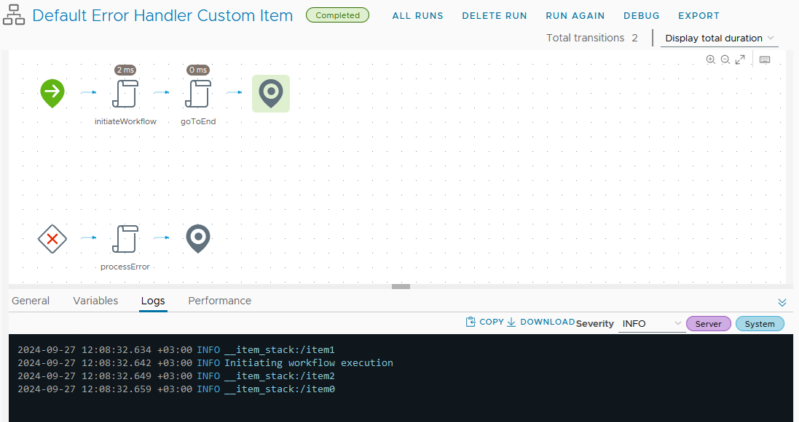
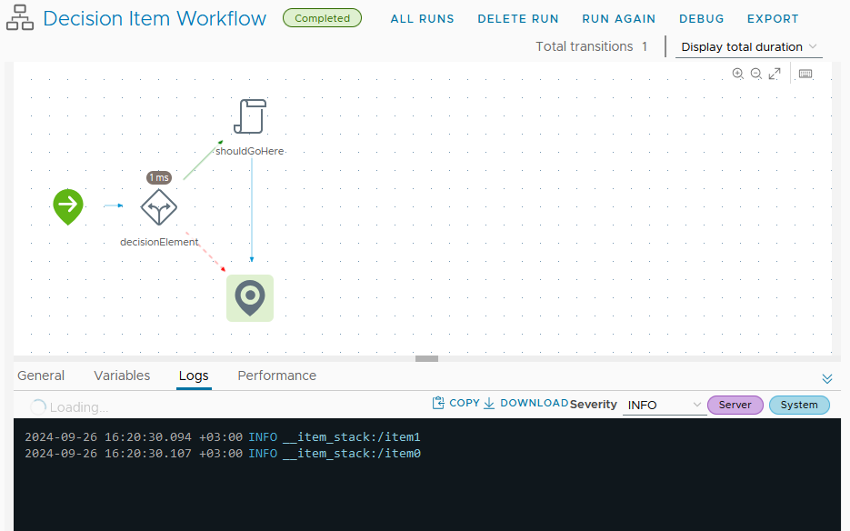
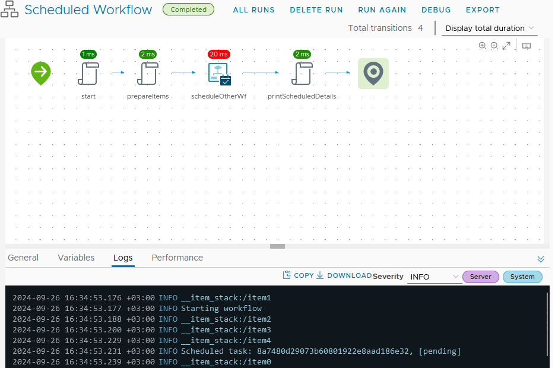
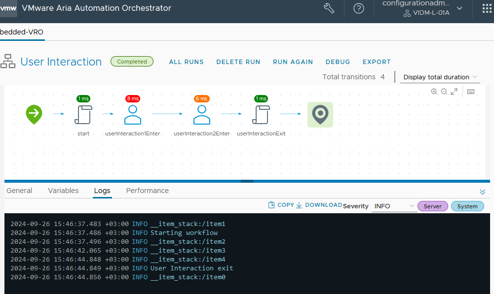

# Workflows

How to use Aria Orchestrator Workflows and available decorators.

## Overview

You can use the method decorators to define various canvas items that will be included in the workflow.

## Table of Contents

1. [Argument Decorators](#argument-decorators)
2. [Available Method Decorators](#available-method-decorators)
   - [`@DefaultErrorHandler`](#defaulterrorhandler)
   - [`@WorkflowEndItem`](#workflowenditem)
   - [`@Item`](#item)
   - [`@WaitingTimerItem`](#waitingtimeritem)
   - [`@DecisionItem`](#decisionitem)
   - [`@RootItem`](#rootitem)
   - [`@DefaultErrorHandler`](#defaulterrorhandler)
   - [`@UserInteractionWorkflowItem`](#userinteractionworkflowitem)
   - [`@WorkflowEndItem`](#workflowenditem)
3. [Custom Form support](#custom-form-support)
4. [Example Workflow](#example-workflow)

### Argument Decorators

- `@In` - Used to bind an input to a function.
- `@Out` - Used to bind an output to a function.
- `@Err` - Used to bind an error to a function.

### Available Method Decorators

#### `@DefaultErrorHandler`

This decorator is used to specify a default error handler. It can be bound either to a workflow item component or workflow end.

#### Supported Parameters

- `target` - target item to be attached to the default error handler, could be one of workflow item or workflow end.
- `exceptionVariable` - Exception variable that will hold the exception data when triggered.

In order to bind inputs and outputs, you do it with the `@In` and `@Out` decorators. This is the same way we do it for other items.

#### Example

```ts
import {
  Workflow,
  RootItem,
  In,
  Out,
  Err,
  Item,
  DefaultErrorHandler,
  WorkflowEndItem,
} from "vrotsc-annotations";

@Workflow({
  name: "Default Error Handler Workflow",
  path: "VMware/PSCoE",
  description:
    "Default error handler workflow with error handler redirecting to a workflow item",
  attributes: {
    errorMessage: {
      type: "string",
    },
  },
})
export class DefaultErrorHandlerWorkflow {
  @RootItem({ target: "workflowEnd" })
  public initiateWorkflow() {
    System.log("Initiating workflow execution");
  }

  @Item({
    target: "end",
  })
  public goToEnd() {
    // NOOP
  }

  @Item({
    target: "workflowEnd",
  })
  public processError(@In errorMessage: string) {
    System.log(
      `Processing error using custom task with message '${errorMessage}'`
    );
  }

  @DefaultErrorHandler({
    target: "processError",
    exceptionBinding: "errorMessage",
  })
  public defaultErrorHandler(@Out @Err errorMessage: string) {
    // NOOP
  }

  @WorkflowEndItem({
    endMode: 0,
  })
  public workflowEnd(@Out @Err errorMessage: string) {
    System.log(`Terminating workflow with error ${errorMessage}`);
  }
}
```

The example above would generate the following workflow.

[](images/Canvas_Item_Default_Error_Handler_Workflow.png)

#### `@WorkflowEndItem`

The decorator is used to specify a custom workflow end item.

##### Supported Parameters

- `endMode` - End mode of the component, could be one of 0 or 1, where 0 is exit success and 1 is error.
- `exceptionVariable` - Exception variable that will hold the exception data when triggered.
- `businessStatus` - Value of the business status in the end component.

#### `@Item`

This decorator is used to specify a scriptable task.

##### Supported Parameters

- `target` - The name of the next in line item. If this is set to `end`, it will point to the end of the workflow. If this is set to `null`, it will point to the next item or if none, the end of the wf. If this is set to a string, but it does not exist in the workflow, it will point to the end of the wf.
- `exception` - **Not implemented yet**

#### `@WaitingTimerItem`

This decorator is used to specify a waiting timer.

##### Supported Parameters

- `target` - The name of the next in line item. Same as `@Item`. This decorator expects an `@In` parameter with the name of the waiting timer. If one isn't added, the workflow will not work.

##### Example

```ts
import { Workflow, In, WaitingTimerItem } from "vrotsc-annotations";

@Workflow({
  name: "Waiting Timer Workflow",
  path: "VMware/PSCoE",
  description: "Waiting timer will point with target to shouldGoHere",
  attributes: {
    waitingTimer: {
      type: "Date",
    },
  },
})
export class WaitingTimerWorkflow {
  @WaitingTimerItem({
    target: "shouldGoHere",
  })
  public waitForEvent(@In date: Date) {
    // NOOP
  }

  public shouldGoHere() {
    // NOOP
  }
}
```

The example above would generate the following workflow.

[](images/Waiting_Timer_Canvas_Item_Workflow.png)

#### `@DecisionItem`

This decorator is used to specify a decision item.

##### Supported Parameters

- `target` - The name of the next in line item. Same as `@Item`.
- `else` - The name of the next in line item if the decision is false. If this is set to `end`, it will point to the end of the workflow. If this is set to `null`, it will point to the next item or if none, the end of the wf. If this is set to a string, but it does not exist in the workflow, it will point to the end of the wf.

##### Example

```ts
import { Workflow, DecisionItem } from "vrotsc-annotations";

@Workflow({
  name: "Decision Item Workflow",
  path: "VMware/PSCoE",
  description:
    "decisionElement is the root, it will point with else to end and target to shouldGoHere. shouldGoHere will point to end too",
  attributes: {
    waitingTimer: {
      type: "Date",
    },
  },
})
export class DecisionItemWorkflow {
  @DecisionItem({
    target: "shouldGoHere",
    else: "end",
  })
  public decisionElement(waitingTimer: Date) {
    return waitingTimer !== null;
  }

  // This will point to end too, but no incoming
  public shouldGoHere() {
    // NOOP
  }
}
```

The example above would generate the following workflow.

[](images/Decision_Item_Canvas_Item_Workflow.png)

#### `@WorkflowItem`

The decorator is used to specify a workflow item that will be called.

##### Supported Parameters

- `target` - The name of the next in line item. Same as `@Item`.
- `linkedItem` - The ID of the workflow to call.

In order to bind inputs and outputs, you do it with the `@In` and `@Out` decorators. This is the same way we do it for other items.

#### `@ScheduledWorkflowItem`

The decorator is used to specify a scheduled workflow item that will be called.

##### Supported Parameters

- `target` - The name of the next in line item. Same as `@Item`.
- `linkedItem` - The ID of the workflow to schedule.

In order to bind inputs and outputs, you do it with the `@In` and `@Out` decorators. This is the same way we do it for other items.

##### Inputs

Special input is needed for the ScheduledWorkflowItem.

- `workflowScheduleDate` - {Date} is required. The name **must** be `workflowScheduleDate`. If this is missing an error is thrown. We don't check if the type is `Date` but Aria Orchestrator will complain.

##### Outputs

Special output is needed for the ScheduledWorkflowItem.

- `scheduledTask` - {Task} is optional. If it's missing nothing will happen, if it's added, then the name **must** be `scheduledTask`. This is the task that is scheduled.

##### Example

```ts
import {
  Workflow,
  Out,
  In,
  Item,
  RootItem,
  ScheduledWorkflowItem,
} from "vrotsc-annotations";

@Workflow({
  name: "Scheduled Workflow",
  path: "VMware/PSCoE",
  description: "Scheduling another workflow and binding values correctly",
  attributes: {
    workflowScheduleDate: {
      type: "Date",
    },
    scheduledTask: {
      type: "Task",
    },
  },
})
export class ScheduledWorkflow {
  @RootItem({ target: "prepareItems" })
  public start() {
    System.log("Starting workflow");
  }

  @Item({ target: "scheduleOtherWf" })
  public prepareItems(@In @Out workflowScheduleDate: Date) {
    workflowScheduleDate = System.getDate("1 minute from now", null);
  }

  @ScheduledWorkflowItem({
    target: "printScheduledDetails",
    linkedItem: "c2c9d5c4-468e-3cde-a64a-d1de50989214",
  })
  public scheduleOtherWf(
    @In first: number,
    @In second: number,
    @In workflowScheduleDate: Date,
    @Out scheduledTask: Task
  ) {
    // NOOP
  }

  @Item({ target: "end" })
  public printScheduledDetails(@In scheduledTask: Task) {
    System.log(`Scheduled task: ${scheduledTask.id}, [${scheduledTask.state}]`);
  }
}
```

The example above would generate the following workflow.

[](images/Scheduled_Workflow_Canvas_Item_Workflow.png)

#### `@RootItem`

This is a meta decorator. Add this to whichever function you want to be the entry point of the workflow.

#### `@AsyncWorkflowItem`

##### Supported Parameters

- `@AsyncWorkflowItem({target: "", linkedItem: "" })`
  - `target` - The name of the next in line item.
  - `linkedItem` - The ID of the workflow to call

##### Outputs

Special output is needed for the AsyncWorkflowItem.

- `wfToken` - {WorkflowToken} is required. The name **must** be `wfToken`. If this is missing an error is thrown. We don't check if the type is `WorkflowToken` but Aria Orchestrator will complain.

##### Inputs

No special inputs are needed for the AsyncWorkflowItem.

#### `@ActionItem`

##### Supported Parameters

- `@ActionItem({target: "", scriptModule: "" })`
  - `target` - The name of the next in line item. Same as `@Item`.
  - `scriptModule` - The path of the action you want to call and the action name, separated by `/`. Example: `com.vmware.pscoe.library.general/echo`.

In order to bind inputs and outputs, you do it with the `@In` and `@Out` decorators. This is the same way we do it for other items.

##### Outputs

There is a requirement to have only one output, and it will be of type `ActionResult`.

#### `@UserInteractionWorkflowItem`

The decorator is used to specify an user interaction workflow item.

##### Supported Parameters

- `target` - The name of the target to that user interaction workflow item is connected to. You can specify another user interaction workflow item as a target, thus chaining multiple user interaction components.

In order to bind inputs and outputs, you do it with the `@In` and `@Out` decorators.

##### Inputs

If you need to specify certain access limitation for the user interaction component you can specify them with `@In` decorators.
Those inputs are optional.

- `security_assignees` (type `Array/LdapUser`) - Any user from this array of users will be authorized to fill in this form.
- `security_assignee_groups` (type `Array/LdapGroup`) - Any user member of any of the groups will be authorized to fill in this form.
- `security_group` (type `LdapGroup`) - Any user member of this group will be authorized to fill in this form.
- `timeout_date` (type `Date`) - If not null, this input item will wait until date and will continue workflow execution.

Note that those parameters should match also the input parameters of the workflow.

##### Known Limitations for the Input Parameters

The names of the variables in the additional method decorators should be as following:

- `security_assignees` - for the security assignees parameter.
- `security_assignee_groups` - for the security assignee group parameter.
- `security_group` - for the security group parameter.
- `timeout_date` - for the timeout date parameter.

##### Outputs

You can specify multiple output variables that would hold the answer of the user interaction components.

##### Example

```ts
import {
    Workflow,
    In,
    Item,
    RootItem,
    UserInteractionItem,
} from "vrotsc-annotations";

@Workflow({
    name: "User Interaction",
    path: "VMware/PSCoE",
    description: "Adding user interaction parameters",
})
export class UserInteractionWorkflow {

    @RootItem({ target: "userInteraction1Enter", exception: "" })
    public start() {
        System.log("Starting workflow");
    }

    @UserInteractionItem({
        target: "userInteraction2Enter",
    })
    public userInteraction1Enter() {
        System.log("User interaction component 1 activation");
    }

    @UserInteractionItem({
        target: "userInteractionExit",
    })
    public userInteraction2Enter(
        @In security_assignees: LdapUser[],
        @In security_assignee_groups: LdapGroup[],
        @In security_group: LdapGroup,
        @In timeout_date?: Date,
        @In userInteractionAnswer?: string
    ) {
        System.log("User interaction component 2 activation");
    }

    @Item({ target: "end" })
    public userInteractionExit(@In userInteractionAnswer: string) {
        System.log("User Interaction exit");
    }
}
```

The example above would generate the following workflow.

[](images/User_Interaction_Canvas_Item_Workflow.png)

### Custom Form Support

You can push `Workflow Custom Form` and `User Interaction Custom Forms` provided as separate files containing the forms as JSON definitions. The files need to be placed in the same folder as the related `.wf.ts` file and must follow naming conventions:
- `Workflow Custom Form`: `{{workflowFileName}}.wf.form.json` where:
  - `workflowFileName` - is the actual file name of the `.wf.ts` definition file (which might be different from the `Workflow` name defined in the `name` key inside the `@Workflow` decorator parameters).
- `User Interaction Custom Form`: `{{workflowFileName}}_input_form_{{userInteractionItemId}}.wf.form.json` where:
  - `workflowFileName` - is the actual file name of the `.wf.ts` definition file (which might be different from the `Workflow` name defined in the `name` key inside the `@Workflow` decorator parameters).
  - `userInteractionItemId` - the ID of the `User Interaction` component as defined in the UI (autogenerated if the component is manually added to the `Workflow` schema) or in the JSON definition under `itemId` key.

Only a single `Workflow Custom Form` is supported per `Workflow` and a single `User Interaction Custom Form` per `User Interaction` element (which can lead to having multiple `User Interaction Custom Form` definition files mapped to a single `wf.ts` file based on the number of `User Interactions` in the `Workflow`).

If no `User Interaction Custom Form` file definition is provided (or the naming convention is not properly followed) the following default empty definition is used which can then be editted in the Orchestrator UI:
```json
{
    "schema": {},
    "layout": {
        "pages": []
    },
    "itemId": "{{itemId}}"
}
```


:scroll:**NOTE!** Currently `pull` operation for `Custom Forms` is not supported. As a workaround you can:
- use an `XML` based project to pull the forms, move them to the proper folder and rename them to match the naming convention.
- Navigate to the Orchestrator UI, open the `Workflow` edit page and navigate to `Version History` from where you can extract the `YAML` definition, convert it to `JSON` and place it in a file.

#### Example

Example file structure:

```ascii
service-automation
├── README.md
├── pom.xml
├── release.sh
├── tsconfig.json
└── src
    └── integration-service-1
        └── workflows
            └── CreateIntegration.wf.ts
            └── CreateIntegration.wf.form.json
            └── CreateIntegration_input_form_item2.wf.form.json
```

Example `User Interaction Custom Form` definition:
```json
{
    "layout": {
        "pages": [
            {
                "id": "page_3efd02e1",
                "sections": [
                    {
                        "id": "section_f2d0f1d1",
                        "fields": [
                            {
                                "id": "textArea_f5932870",
                                "display": "textArea",
                                "state": {
                                    "visible": true,
                                    "read-only": false
                                },
                                "signpostPosition": "right-middle"
                            }
                        ]
                    }
                ],
                "title": "Approval details",
                "state": {}
            }
        ]
    },
    "schema": {
        "textArea_f5932870": {
            "label": "User name",
            "placeholder": "",
            "type": {
                "dataType": "string"
            },
            "constraints": {}
        }
    },
    "options": {
        "externalValidations": []
    },
    "itemId": "item2"
}
```

### Example Workflow

This example workflow combines all currently supported method decorators in a single workflow.

```ts
/*-
 * #%L
 * vro.ts.workflows
 * %%
 * Copyright (C) 2024 TODO: Enter Organization name
 * %%
 * TODO: Define header text
 * #L%
 */
import {
  Workflow,
  Out,
  In,
  Item,
  RootItem,
  DecisionItem,
  WaitingTimerItem,
  WorkflowItem,
  WorkflowEndItem,
  ScheduledWorkflowItem,
} from "vrotsc-annotations";

@Workflow({
  name: "Complex Workflow",
  path: "VMware/PSCoE",
  attributes: {
    waitingTimer: {
      type: "Date",
    },
    counter: {
      type: "number",
    },
    first: {
      type: "number",
    },
    second: {
      type: "number",
    },
    result: {
      type: "number",
    },
    workflowScheduleDate: {
      type: "Date",
    },
    scheduledTask: {
      type: "Task",
    },
    errorMessage: {
      type: "string",
    },
    wfToken: {
      type: "WorkflowToken",
    },
    actionResult: {
      type: "ActionResult",
    },
  },
})
export class ComplexWorkflow {
  @RootItem({ target: "execute" })
  public start() {
    System.log("Starting workflow");
  }

  @Item({ target: "decisionItem" })
  public execute(@Out @In waitingTimer: Date, @Out @In counter: number): void {
    if (!counter) {
      counter = 0;
    }
    counter++;
    if (counter < 2) {
      const tt = Date.now() + 5 * 1000;
      waitingTimer = new Date(tt);
    } else {
      waitingTimer = null;
    }
    System.log("Counter: " + counter);
    System.log("Waiting Timer: " + waitingTimer);
  }

  @DecisionItem({ target: "waitForEvent", else: "prepareItems" })
  public decisionItem(waitingTimer: Date) {
    return waitingTimer !== null;
  }

  @WaitingTimerItem({ target: "callAction" })
  public waitForEvent(@In waitingTimer: Date) {
    // NOOP
  }

  @ActionItem({
    target: "printActionResult",
    scriptModule: "com.vmware.pscoe.library.ecmascript/Set",
  })
  public callAction(
    @In first: number,
    @In second: number,
    @Out actionResult: ActionResult
  ) {
    // NOOP
  }

  @Item({ target: "callOtherWf" })
  public prepareItems(
    @In @Out first: number,
    @In @Out second: number,
    @In @Out workflowScheduleDate: Date
  ) {
    first = 1;
    second = 2;
    workflowScheduleDate = System.getDate("1 minute from now", undefined);
  }

  @WorkflowItem({
    target: "print",
    linkedItem: "c2c9d5c4-468e-3cde-a64a-d1de50989214",
  })
  public callOtherWf(
    @In first: number,
    @In second: number,
    @Out result: number
  ) {
    // NOOP
  }

  @Item({ target: "scheduleOtherWf" })
  public print(@In result: number) {
    System.log("Result: " + result);
  }

  @ScheduledWorkflowItem({
    target: "printScheduledDetails",
    linkedItem: "9e4503db-cbaa-435a-9fad-144409c08df0",
  })
  public scheduleOtherWf(
    @In first: number,
    @In second: number,
    @In workflowScheduleDate: Date,
    @Out scheduledTask: Task
  ) {
    // NOOP
  }

  @Item({ target: "asyncCall" })
  public printScheduledDetails(@In scheduledTask: Task) {
    System.log(`Scheduled task: ${scheduledTask.id}, [${scheduledTask.state}]`);
  }

  @AsyncWorkflowItem({
    target: "printAsync",
    linkedItem: "9e4503db-cbaa-435a-9fad-144409c08df0",
  })
  public asyncCall(
    @In first: number,
    @In second: number,
    @Out wfToken: WorkflowToken
  ) {
    // NOOP
  }

  @Item({ target: "printActionResult" })
  public printAsync(@In wfToken: WorkflowToken) {
    System.log(`Workflow token: ${wfToken.id} and state: ${wfToken.state}`);
  }

  @Item({ target: "end" })
  public printActionResult(@In actionResult: ActionResult) {
    System.log(`Action result: ${JSON.stringify(actionResult, null, 4)}`);
  }
}
```

The example above would generate the following workflow.

[](images/Canvas_Item_Complex_Workflow.png)
