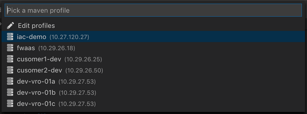
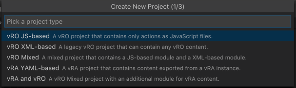
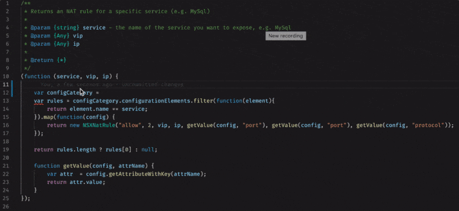
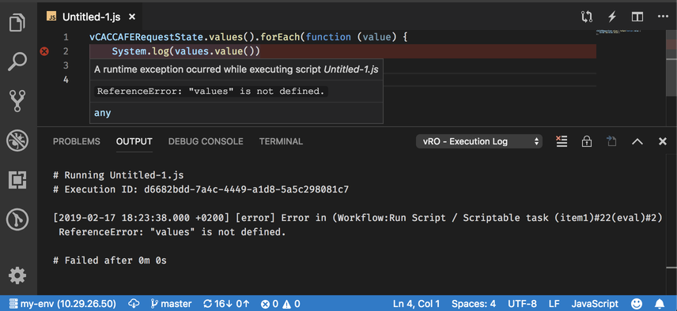
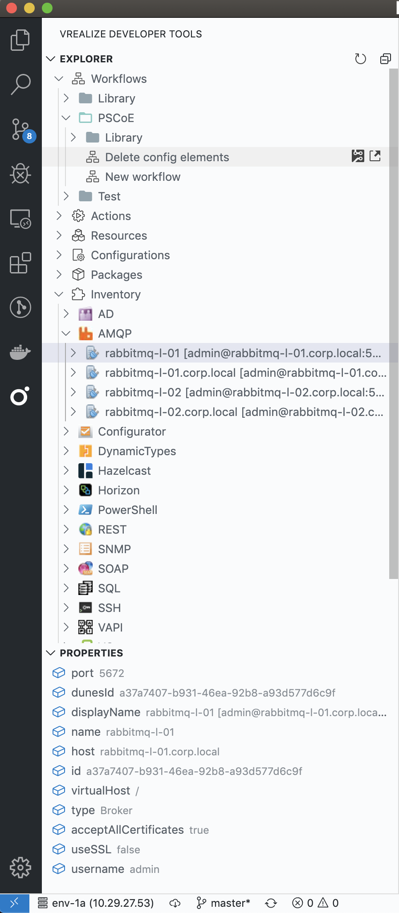
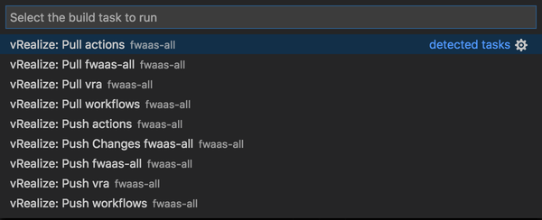
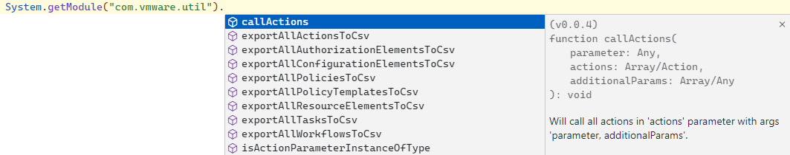
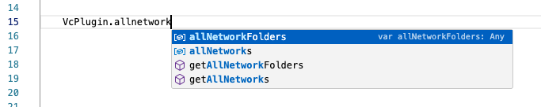

# Using the VS Code Extension

## Overview

A Visual Studio Code extension that provides code intelligence features and enables a more developer-friendly experience when creating VMware vRealize Orchestrator and VMware vRealize Automation content.

For detailed information on the vRDT Extension please refer to the extensions [Github repository](https://github.com/vmware/vrealize-developer-tools) and its [documentation](https://github.com/vmware/vrealize-developer-tools/tree/master/wiki).

## Features

### Multiple environments

Connect to different {{ products.vro_short_name }} environments by configuring maven profiles in `~/.m2/settings.xml`.

```xml
<profile>
    <id>my-env</id>
    <properties>
        <!-- {{ products.vro_short_name }} Connection -->
        <vro.host>10.27.120.27</vro.host>
        <vro.port>443</vro.port>
        <vro.username>administrator@vsphere.local</vro.username>
        <vro.password>myPlainTextPass</vro.password>
        <vro.auth>basic</vro.auth> <!-- or 'vra' for sso auth -->
        <vro.tenant>vsphere.local</vro.tenant>
        <vro.authHost>10.27.120.27</vro.authHost> <!-- required for 'vra' auth -->
        <vro.refresh.token>CrxGISrDKxqwfvitdnmlodXxneHARsFi</vro.refresh.token>

        <!-- vRA Connection -->
        <vra.host>10.27.120.27</vra.host>
        <vra.port>443</vra.port>
        <vra.username>configurationadmin@vsphere.local</vra.username>
        <vra.password>myPlainTextPass</vra.password>
        <vra.tenant>vsphere.local</vra.tenant>
    </properties>
</profile>
```

Once vRealize Developer Tools extension is activated in VS Code, on the bottom left corner of the status bar, an idicator is shown if there is no currently active profile.


Click on it to see list of all available profiles and select one to activate.



Active profile name and the IP address of the vRealize Orchestrator instance is shown in the status bar.


### Project on-boarding

The `vRealize: New Project` command from the VS Code comand palette (<kbd>Cmd+Shift+P</kbd> / <kbd>Ctrl+Shift+P</kbd>) can be used to on-board a new vRealize project.



### {{ products.vro_short_name }}-aware IntelliSense

Visual Studio Code's IntelliSense feature for JavaScript files is enhanced with with symbols and information from the {{ products.vro_short_name }}’s core scripting API, plug-in objects and actions.



### Run action

The `vRealize: Run Action` command from the VS Code comand palette (<kbd>Cmd+Shift+P</kbd> / <kbd>Ctrl+Shift+P</kbd>) allows running an action JavaScript file in live {{ products.vro_short_name }} instance while seeing the logs in the OUTPUT panel.



### Explore the inventory

An {{ products.vro_short_name }} explorer view is available in the activity bar that allows browsing the whole {{ products.vro_short_name }} inventory (actions, workflows, resources, configurations, packages and plugin objects).

-   Browse, search by name, fetch source (read-only) of all elements
-   Fetch schema (read-only) of workflows
-   3 different layouts for the actions hierarchy (controlled by `vrdev.views.explorer.actions.layout` setting)
    -   **tree** - Displays action packages as a tree
    -   **compact** - Displays action packages as a tree, but flattens any folders that have no children
    -   **flat** - Displays action packages as a list
-   Delete packages
-   Browse the inventory and see properties of each plugin object



#### Inventory Caching

There is a support for {{ products.vro_short_name }} inventory items caching in order not to overload {{ products.vro_short_name }} on heavily loaded environments. If the vrdev:vro:inventory:cache setting is enabled in the plugin settings, the {{ products.vro_short_name }} inventory items will be fetched once from the {{ products.vro_short_name }} server during visual studion code session. When there are changes in {{ products.vro_short_name }} inventory made during visual studio code session they will not be fetched. In order to maintain fresh load of data either disable the cache setting or reload the visual studio code.

### Push and Pull content

The VS Code build tasks palette (<kbd>Cmd+Shift+B</kbd> / <kbd>Ctrl+Shift+B</kbd>) contains commands for pushing content to a live {{ products.vro_short_name }}/vRA instance and for pulling workflows, configurations, resources and vRA content back to your local machine – in a form suitable for committing into source control.



The `vrdev.tasks.exclude` setting can be used to _exclude_ certain projects from the list of build tasks (`Cmd+Shift+B`) by using glob patterns

```javascript
"vrdev.tasks.exclude" : [
    "my.example.library*", // Exclude all libraries
    "!my.example.library*", // Exclude everything, except libraries
    "my.example!(library*)", // Exclude everything from 'my.example', except libraries
    "my.example.library:{nsx,vra,vc}", // Exclude nsx, vra and vc libraries
    "my.example.library:util" // Exclude util library (<groupId>:<artifactId>)
]
```

#### Display Hints in Java Script Projects

The VS Code plugin supports displaying action hints for modules and actions that are present in {{ products.vro_short_name }} along with the modules and actions that are part of the currently opened project. If you type:

```javascript
System.getModule("com.module.path.").
```

or

```javascript
Class.load("com.module.path.").
```

a list of hints with modules available on {{ products.vro_short_name }} and in locally opened projects would be presented as list, furthermore methods and parameters would be also present as hints, as shown in the example below:



The hinting functionality also supports displaying hints for constructors, methods and attributes of all Scripting API ({{ products.vro_short_name }} plugin) objects available on the {{ products.vro_short_name }} server, as shown in the example below:


