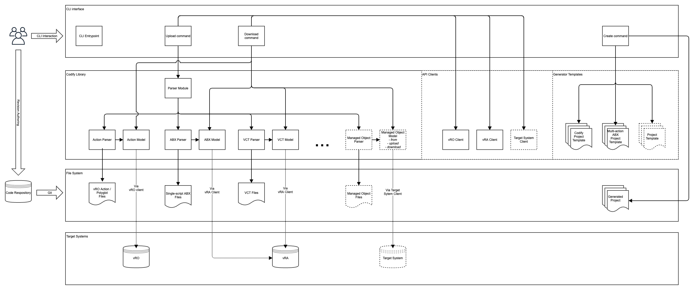

# How to contribute to **Codify**

Thank you for taking the time to contribute to **Codify**.

This guide will walk you through the process of making your first commit and
how to effectively get it merged upstream.

<!-- toc -->

- [Contribute](#contribute)
- [Examples](#examples)
- [Architecture](#architecture)
<!-- /toc -->

# Contribute

1. Fork the repository.
1. Install the dependencies via `npm install`. This will install all development and production dependencies.
1. Make changes and create commits with meaningful comments.
1. Write unit tests. All tests must be passing in order for the commit to be accepted.
   This is controlled via pre-commit hook.
1. Once ready, open a PR against the repository providing comments of the intent of the change.

# Building and testing

```sh
# To run unit tests
npm run test

# To build Codify
npm run build
```

## Build in a Docker container

If your environment is not set up for NodeJS development you can build the project using a Docker container
by running the following command from the root of the project:

```sh
git archive HEAD -o codify.zip && \
    docker run --rm -it -v (pwd)/dist:/usr/app/dist \
    -v (pwd)/codify.zip:/usr/app/codify.zip -w /usr/app \
    docker-repo-url \
    /bin/bash -c 'unzip codify.zip && npm install && npm run build'
```

# [Examples](./examples)

Codify comes with example content demonstrating the content authoring and
usage of the Codify commands to interact with the content and the remote
environment.

## Prerequisites

1. Do `npm install` to install the dependencies.
1. Create a **.env** file or export the following environment variables:
    ```sh
    # .env
    VRO_HOST=<host>
    VRO_USER=<username>
    VRO_PASS=<password>
    VRA_HOST=<host>
    VRA_USER=<username>
    VRA_PASS=<password>
    ```

## Running the examples

You can run the examples by running the following commands:

```sh
# To upload all objects from a directory and its children
npm run cli:dev -- upload --source ./examples

# To upload a single object
npm run cli:dev -- upload --source ./examples/actions/exampleAction.js

# To download one or more actions (add an --action option for every action)
npm run cli:dev -- download --target examples --action com.vmware.acoe.demo/examplePolyglotAction

# To download one or more workflows (add a --workflow option for every workflow)
npm run cli:dev -- download --target examples/workflows --workflow "ACoE/Sample Workflow"

# To download one or more configurations (add a --config option for every configuration)
npm run cli:dev -- download --target examples/configs --config "ACoE/Sample Config"

# To download one or more cloud template (add a --template option for every VCT)
npm run cli:dev -- download --target examples/cloudtemplates --template "Example Template"

# To download one or more resource action (add a --day2 option for every resource action)
npm run cli:dev -- download --target examples/resourceactions --day2 "sampleaction"

# To download one or more subscription (add a --subscription option for every subscription)
npm run cli:dev -- download --target examples/subscriptions --subscription "Sample Subscription"

# To download one or more ABX actions (add an --abx option for every action)
npm run cli:dev -- download --target examples/abx --abx "My Action"

# To run an action
npm run cli:dev -- run --action com.vmware.acoe.demo/examplePolyglotAction
```

# Architecture

## Logical Decomposition



## Adding new managed object types

Codify is designed with modularity in mind so that adding support for new
object types, e.g. custom resources, is relatively easy process. It is a matter of implementing two classes:

- A parser class that must implement an `IParser` interface to be recognized by the base parsing logic.
    It is responsible for parsing file-system level objects, i.e., managed object serialization in a file – JS, YAML
    or another resource-specific file. The parser class resides in `src/parser` directory.
- And a model class that extends a base model class and overrides several methods for basic interaction such as
    `upload`, `download` and a static `from` method for remote object state resolution. The model class resides
    in `src/model` directory.

