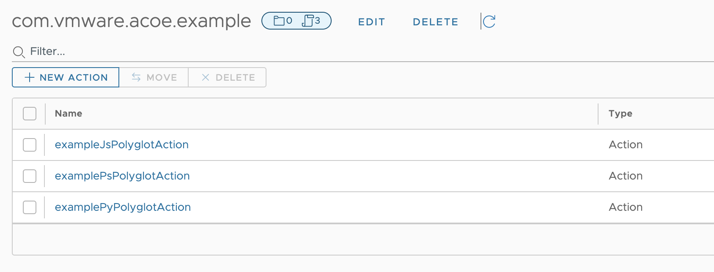
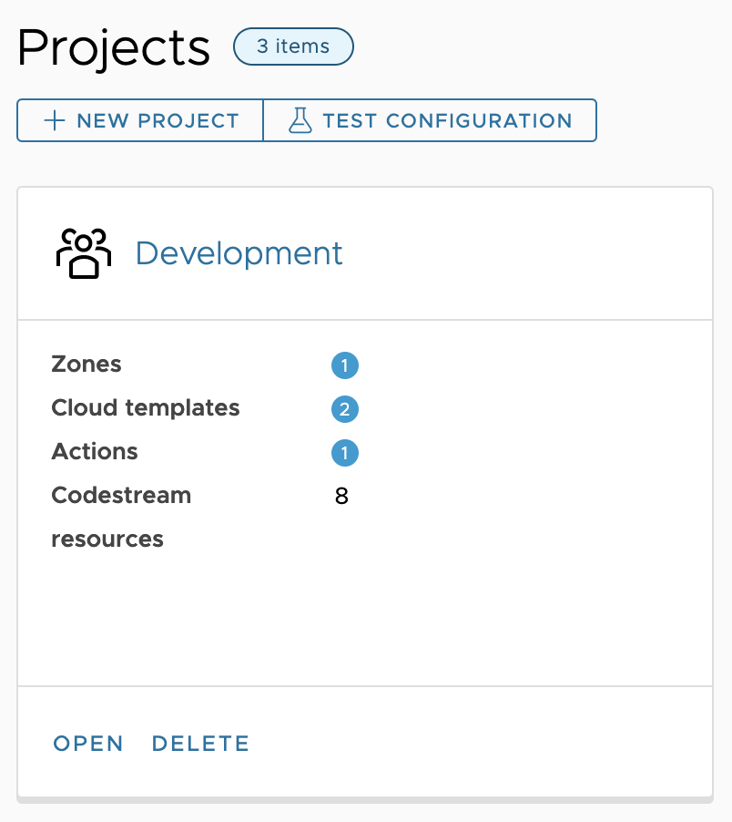
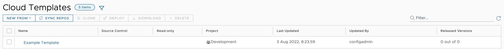
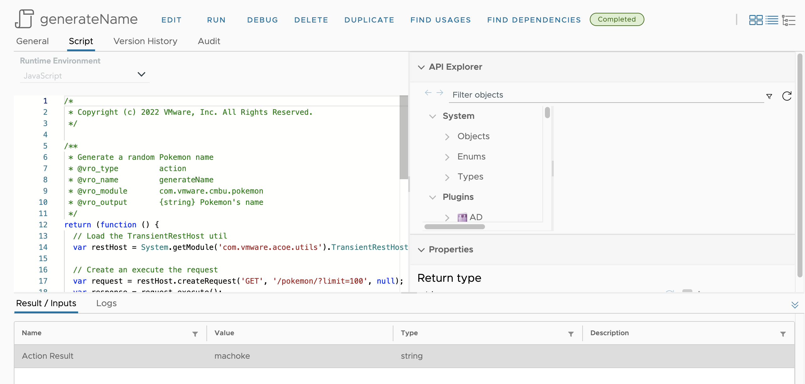
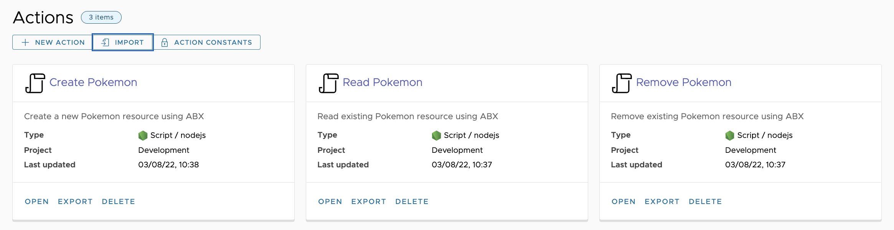
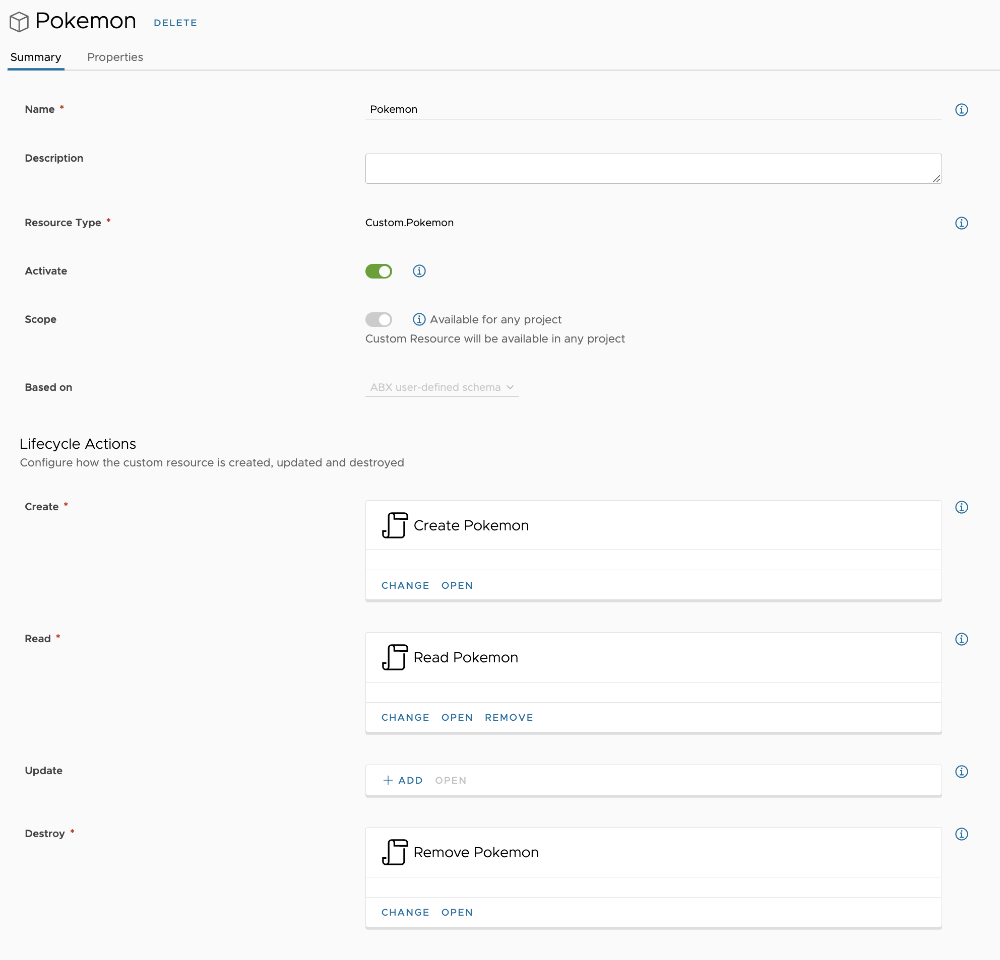
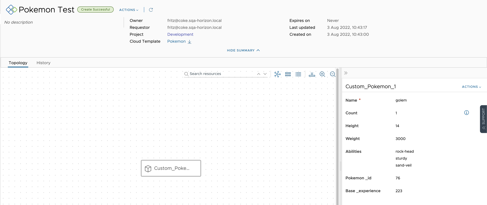
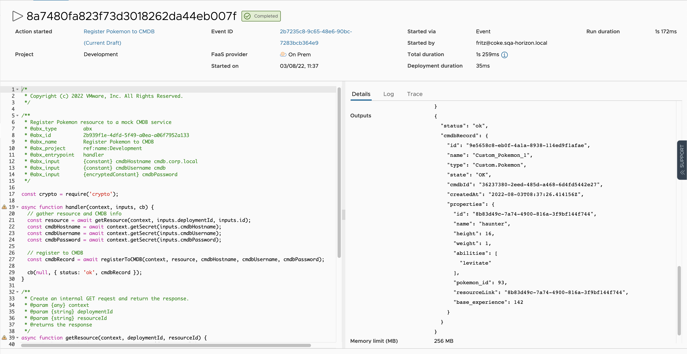

# Prerequisites

**Required:**

- [Node.js 14+](https://nodejs.org/en/download/)
- A running vRA instance for uploading and downloading content

**Optional but recommended:**

The following prerequisites are needed for ABX bundle development (Python and PowerShell), testing and packaging.

- [Python 3+](https://www.python.org/downloads/)
- [Docker](https://www.docker.com/get-started/)

# Tutorial: Installation

In this tutorial we will install Codify from Artifactory and validate that it properly set up.

```sh
# Install Codify
npm install -g @vmw/build-tools-for-vmware-aria-codify

# Verify that Codify is installed
codify --version
```

# Tutorial: vRO / vRA Content Management

In this tutorial we will generate a new Codify project and will perform basic interactions with the sample content. This will give us basic understanding of the Codify usage and will illustrate some important concepts for content authoring.

## Project Setup

Let's create a new project that Codify recognizes:

```sh
codify create

✔ What is your project named? … my-project
✔ Add sample content? … yes
✔ Install project dependencies? … yes
```

Codify will generate a new empty project for you and will populate some sample content to get started. The src directory contains the source content that we'll be working with. It is organized according to its type and where applicable the parent category / module structure is also included, e.g. with vRO actions, configurations, and workflows.

Codify needs to know how to connect to a remote vRA / vRO. Let's configure your remote vRA connection. Edit the `.env` file in your project:

`.env`

```
# My Testing Environment
VRO_HOST=<vro-host>
VRO_USER=configadmin
VRO_PASS=VMware1!

VRA_HOST=<vra-host>
VRA_USER=configadmin
VRA_PASS=VMware1!
```

## Upload vRO content

Let's upload some of the sample content to vRO:

```sh
codify upload --source src/actions --sequential
```

The `--sequential` option tells Codify to avoid parallel upload. For now this is needed to avoid concurrency issues when creating the module for the actions. Any subsequent uploads can be without the `--sequential` option to speed up the process.

This will upload the sample actions within vRO:



## Upload vRA content

Let's upload something to vRA as well. Make sure you have a **Development** project in your vRA:



Run the following command to upload the sample cloud template to Cloud Assembly:

```sh
codify upload --source src/cloudtemplates
```

This will create / update the Example Template in the Design tab:



## Download vRA content

Let's modify our cloud template in Cloud Assembly and download the changes locally. Add a new input to the cloud template:

```yaml
ntp:
    type: string
    title: NTP Server
    default: ntp.vmware.com
```

Run the following command to download the updated version of the template locally:

```sh
codify download --target src/cloudtemplates --template "Example Template"
```

The contents of the **"src/cloudtemplates/Example Template.vct.yaml"** file gets updated with the change.

# Tutorial: Pokemon as a Service

In this tutorial we will create a **Pokemon as a Service** solution in vRA which will allow users to consume a custom Pokemon resource from a Cloud Template. We will also dynamically generate a new Pokemon every time we make a deployment, and we will also incorporate the Pokemons we deploy with a mock CMDB system using extensibility.

We will be using extensively the [PokeAPI](https://pokeapi.co/docs/v2#pokemon-section) so make sure you are able to access it from within ABX and vRO.

As content, we will create:

- An external Pokemon name generator action in vRO
- A set of ABX actions for the Pokemon CRUD operations
- A custom resource that will use the CRUD ABX actions
- A cloud template which will define our Pokemon deployment structure
- An ABX action which will register the Pokemon to a mock CMDB
- A vRA subscription which will invoke the CMDB ABX action

Let's get started!

## Project setup

```sh
codify create

✔ What is your project named? … vra-pokemon
✔ Add sample content? … no
✔ Install project dependencies? … yes
```

Open the project in your favourite IDE.

Edit the `.env` file to contain the host and credentials to your vRA instance.

`.env`

```
# My Testing Environment
VRO_HOST=<vro-host>
VRO_USER=configadmin
VRO_PASS=VMware1!

VRA_HOST=<vra-host>
VRA_USER=configadmin
VRA_PASS=VMware1!
```

## Create the Pokemon name generator

We need to create two actions which will produce a new name for our Pokemon:

- a utility TransientRestHost action which will create a new transient REST host for our name generation action.
- a name generation action which will use the transient REST host to make a request to the PokeAPI for retrieving a list of Pokemons and randomly selecting one of them.

Create a new **TransientRestHost** action:

`src/actions/com.vmware.acoe.utils/TransientRestHost.js`

```js


/**
 * Create transient RestHost
 * @vro_type        action
 * @vro_version     1.0.0
 * @vro_input       {string} baseUrl REST host base URL
 * @vro_output      {RESTHost}
 */
return (function (baseUrl) {
    // create transient REST host
    var restHost = RESTHostManager.createHost('Transient Host');
    var httpRestHost = RESTHostManager.createTransientHostFrom(restHost);
    httpRestHost.operationTimeout = 60;
    httpRestHost.connectionTimeout = 30;
    httpRestHost.hostVerification = false;
    httpRestHost.url = baseUrl;

    trustCertificate(httpRestHost.url);

    /**
     * Add host's certificate to the local keystore if needed.
     * @param {string} url
     * @returns {void}
     */
    function trustCertificate(url) {
        if (url.toLowerCase().indexOf('https:') === 0) {
            var importAction = eval('Config.getKeystores().getImportCAFromUrlAction()');
            var model = importAction.getModel();
            model.value = url;

            var certValidationResult = importAction.validateCertificates();
            // var certInfo = importAction.getCertInfo();

            var isNotTrusted = certValidationResult.isNoChainOfTrust();
            // var isCertificateExpired = certValidationResult.isCertificateExpired();

            var isDomainWrong = certValidationResult.isWrongDomain();
            // var certificateHostName = certValidationResult.getCertificateHostName();
            var isNotValid = certValidationResult.isNotValid();
            // var errorText = certValidationResult.getErrorText();

            if (isDomainWrong || (isNotValid && !isNotTrusted)) {
                System.debug('Importing certificate for url ' + url);
                importAction.execute();
            }
        }
    }

    return httpRestHost;

    // eslint-disable-next-line no-undef
})(baseUrl);
```

Create a **generateName** action:

`src/actions/com.vmware.cmbu.pokemon/generateName.js`

```js


/**
 * Generate a random Pokemon name
 * @vro_type         action
 * @vro_name         generateName
 * @vro_module       com.vmware.cmbu.pokemon
 * @vro_output       {string} Pokemon's name
 */
return (function () {
    // Load the TransientRestHost util
    var restHost = System.getModule('com.vmware.acoe.utils').TransientRestHost('https://pokeapi.co/api/v2');

    // Create an execute the request
    var request = restHost.createRequest('GET', '/pokemon/?limit=100', null);
    var response = request.execute();

    // Evaluate the response
    if (response.statusCode !== 200) {
        throw new Error('HTTP error: ' + response.statusCode + ' ' + response.statusMessage);
    }

    // Get a random name from the results
    var data = JSON.parse(response.contentAsString);
    var names = data.results.map(function (pokemon) {
        return pokemon.name;
    });

    return names[Math.floor(Math.random() * names.length)];
})();
```

Upload the actions to vRO:

```sh
codify upload --source src/actions
```

Navigate to the vRO UI and run the **generateName** action to see it working:



## Create Pokemon CRUD ABX actions

Let's create a new bundle-based ABX sub-project that will house our CRUD actions which will back the custom Pokemon resource. Run the following command from within the **vra-pokemon** directory (our project's root):

```sh
codify create --abx

✔ What is your project named? … pokemon-abx
✔ What is your ABX runtime? › NodeJS (JavaScript)
```

This will generate a new sub-project within the existing project. It will contain the structure of a multi-action project that will allow us to use a library-based based approach to building ABX actions. It will also contain all the build tooling needed to bundle and publish our ABX actions.

Once the project is generated, navigate to its directory from the terminal and invoke:

```sh
npm install
```

This will install all development dependencies that will allow us to test, build and publish our ABX actions.

Update the contents of the **pokemon-abx/src/create_resource.yaml** and **pokemon-abx/src/remove_resource.yaml**
files to contain the correct ABX definitions:

`pokemon-abx/src/create_resource.yaml`

```yaml
---
name: Create Pokemon
description: Create a new Pokemon resource using ABX
entrypoint: create_resource.handler
timeoutSeconds: 600
deploymentTimeoutSeconds: 900
inputs:
    name: ''
configuration:
    const_azure-system_managed_identity: false
memoryInMB: 300
```

`pokemon-abx/src/remove_resource.yaml`

```yaml
---
name: Remove Pokemon
description: Remove existing Pokemon resource using ABX
entrypoint: remove_resource.handler
timeoutSeconds: 600
deploymentTimeoutSeconds: 900
inputs:
    name: ''
configuration:
    const_azure-system_managed_identity: false
memoryInMB: 300
```

Create a definition for a new ABX action for Pokemon read operations:

`pokemon-abx/src/read_resource.yaml`

```yaml
---
name: Read Pokemon
description: Read existing Pokemon resource using ABX
entrypoint: read_resource.handler
timeoutSeconds: 600
deploymentTimeoutSeconds: 900
inputs:
    name: ''
configuration:
    const_azure-system_managed_identity: false
memoryInMB: 300
```

`pokemon-abx/src/read_resource.js`

```js


const { Resource } = require('./lib/resource');

exports.handler = async function (context, input, cb) {
    const resource = new Resource(context, input);
    const result = await resource.read();
    cb(null, result);
};
```

Update the implementation of the module that will deal with the Pokemon CRUD operations:

`pokemon-abx/src/lib/resource.js`

```js


class Resource {
    constructor(context, input) {
        this.context = context;
        this.input = input;
    }

    /**
     * Create a new Pokemon resource.
     * @returns the new Pokemon
     */
    async create() {
        const pokemon = await this.getPokemon(this.input.name);
        // TODO: create Pokemon in local environment
        console.log(`Created pokemon "${pokemon.name}" with id = ${pokemon.id}`);
        return pokemon;
    }

    /**
     * Remove existing Pokemon resource.
     * @returns Operation status
     */
    async remove() {
        const pokemon = await this.getPokemon(this.input.name);
        // TODO: remove Pokemon from local environment
        console.log(`Removed pokemon "${pokemon.name}" with id = ${pokemon.id}`);
        return {
            status: 'ok',
        };
    }

    /**
     * Read existing Pokemon resource.
     * @returns the Pokemon
     */
    async read() {
        const pokemon = await this.getPokemon(this.input.name);
        return pokemon;
    }

    /**
     * Retrieve Pokemon by name.
     * @param {string} pokemonName Pokemon name
     * @returns the response
     */
    async getPokemon(pokemonName) {
        const data = await this.context.request(`https://pokeapi.co/api/v2/pokemon/${pokemonName}`, 'GET', null);
        const { abilities, base_experience, height, id, name, weight } = data.content;
        return {
            abilities: abilities.map((a) => a.ability.name),
            base_experience,
            height,
            pokemon_id: id,
            name,
            weight,
        };
    }
}

exports.Resource = Resource;
```

Update the sample ABX inputs file to simulate ABX invocations:

`pokemon-abx/abx.input.yaml`

```yaml
---
name: bulbasaur
```

Let's test our ABX actions locally before publishing them

```sh
# Create
node run.js create_resource.handler abx.input.yaml

Using inputs file abx.input.yaml
===================================
ACTION START
===================================
Created pokemon "bulbasaur" with id = 1
===================================
Action completed in 0.218s
Result: {
  abilities: [ 'overgrow', 'chlorophyll' ],
  base_experience: 64,
  height: 7,
  pokemon_id: 1,
  name: 'bulbasaur',
  weight: 69
}
===================================

# Read
node run.js read_resource.handler abx.input.yaml

Using inputs file abx.input.yaml
===================================
ACTION START
===================================
===================================
Action completed in 0.256s
Result: {
  abilities: [ 'overgrow', 'chlorophyll' ],
  base_experience: 64,
  height: 7,
  pokemon_id: 1,
  name: 'bulbasaur',
  weight: 69
}
===================================

# Delete
node run.js remove_resource.handler abx.input.yaml

Using inputs file abx.input.yaml
===================================
ACTION START
===================================
Removed pokemon "bulbasaur" with id = 1
===================================
Action completed in 0.157s
Result: { status: 'ok' }
===================================
```

Now that everything works as expected, let's build the ABX packages:

```sh
npm run build
```

This will produce 3 ZIP archives for our ABX actions in the **dist** directory:

- pokemon-abx/dist/Create Pokemon.abx.zip
- pokemon-abx/dist/Read Pokemon.abx.zip
- pokemon-abx/dist/Remove Pokemon.abx.zip

The archives are directly importable into vRA using the import functionality in ABX. They contain the action
definitions along with the action bundles containing the implementation.

Let's upload them to ABX:



## Create Pokemon custom resource

Let's create a new ABX-backed Custom Resource in Cloud Assembly using the following properties schema:

```yaml
properties:
    name:
        type: string
    pokemon_id:
        type: number
        readOnly: true
        default: 0
    height:
        type: number
        readOnly: true
        default: 0
    weight:
        type: number
        readOnly: true
        default: 0
    abilities:
        type: array
        readOnly: true
        items:
            type: string
        default: []
    base_experience:
        type: number
        readOnly: true
        default: 0
```



# Create Pokemon Cloud Template

Create a new Cloud Template in Cloud Assembly called **Pokemon**:

```yaml
formatVersion: 1
inputs:
    pokemonName:
        type: string
        title: Pokemon Name
        $dynamicDefault: /data/vro-actions/com.vmware.cmbu.pokemon/generateName
        readOnly: true
resources:
    Custom_Pokemon_1:
        type: Custom.Pokemon
        properties:
            name: ${input.pokemonName}
```

Note that we are also defining a read-only **pokemonName** input which takes its value from the **generateName** vRO
action we created earlier. The value of the input is bound to the value of the **name** property of the Pokemon custom
resource and will be propagated to the ABX CRUD actions when they are invoked.

Let's create a new deployment for our Pokemon:



Finally, let's download the cloud template to our project:

```sh
codify download --target src/cloudtemplates --template "Pokemon"
```

## Create ABX action for CMDB integration

In order to integrate each deployed Pokemon with a CMDB we are going to use a single-script ABX action that will
retrieve resource information from the vRA API and will prepare the data which will be recorded to a mock CMDB.
We will not invoke an actual CMDB record creation call, however this can later be added if needed.

Let's create a new script-based ABX action:

`src/abx/pokemonCMDB.js`

```js


/**
 * Register Pokemon resource to a mock CMDB service
 * @abx_type         abx
 * @abx_id           2b939f1e-4dfd-5f49-a0ea-a06f7952a133
 * @abx_name         Register Pokemon to CMDB
 * @abx_project      ref:name:Development
 * @abx_entrypoint   handler
 * @abx_input        {constant} cmdbHostname cmdb.corp.local
 * @abx_input        {constant} cmdbUsername cmdb
 * @abx_input        {encryptedConstant} cmdbPassword
 */

const crypto = require('crypto');

async function handler(context, inputs, cb) {
    // gather resource and CMDB info
    const resource = await getResource(context, inputs.deploymentId, inputs.id);
    const cmdbHostname = await context.getSecret(inputs.cmdbHostname);
    const cmdbUsername = await context.getSecret(inputs.cmdbUsername);
    const cmdbPassword = await context.getSecret(inputs.cmdbPassword);

    // register to CMDB
    const cmdbRecord = await registerToCMDB(context, resource, cmdbHostname, cmdbUsername, cmdbPassword);

    cb(null, { status: 'ok', cmdbRecord });
}

/**
 * Create an internal GET request and return the response.
 * @param {any} context
 * @param {string} deploymentId
 * @param {string} resourceId
 * @returns the response
 */
async function getResource(context, deploymentId, resourceId) {
    console.log(`Retrieving resource with id = ${resourceId}`);
    const data = await context.request(`/deployment/api/deployments/${deploymentId}/resources/${resourceId}`, 'GET');
    return data.content;
}

async function registerToCMDB(context, resource, hostname, username, password) {
    console.log(`Registering Pokemon "${resource.properties.name}" with CMDB`);
    console.log(`Internal id: ${resource.id}`);
    console.log(`CMDB Hostname: ${hostname}`);
    console.log(`CMDB Username: ${username}`);

    return {
        ...resource,
        cmdbId: crypto.randomUUID(),
    };
}

exports.handler = handler;
```

Note the JSDoc in the beginning of the file which defines and determines the ABX action information. We will be
creating an ABX action with a fixed ID which we will refer in our subscription later.

Also, in the implementation we depend on some action constants which will automatically be created and their default
value set by Codify as part of the upload process.

Upload the ABX action using Codify:

```sh
codify upload --source src/abx
```

## Create Subscription for CMD integration

Finally, to complete our solution, we will create a subscription to our Pokemon resource lifecycle to invoke the ABX
action for CMDB integration.

You can choose to create the subscription directly from the UI and then download it to your project, or as a file
in the project and upload it to vRA.

Let's create a new subscription file:

`src/subscriptions/Register Pokemon to CMDB.sub.yaml`

```yaml
objectType: Subscription
id: sub_1659514635365
blocking: false
broadcast: false
constraints:
    projectId: null
contextual: false
criteria: >-
    event.data.resourceType == 'Custom.Pokemon' && event.data.eventType ==
    'CREATE_RESOURCE'
description: ''
disabled: false
eventTopicId: deployment.resource.request.post
name: Register Pokemon to CMDB
priority: 10
runnableId: 2b939f1e-4dfd-5f49-a0ea-a06f7952a133
runnableType: extensibility.abx
system: false
timeout: 0
type: RUNNABLE
```

And upload it using Codify:

```sh
codify upload --source src/subscriptions
```

Test it out by creating a new deployment from our **Pokemon** template. This will invoke the ABX action for
CMDB integration, and it will produce a new CMDB record:


